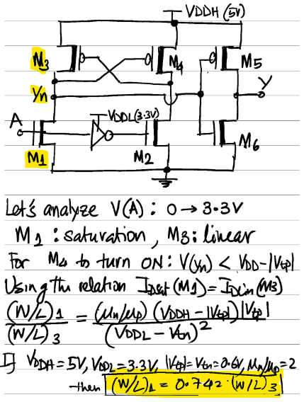
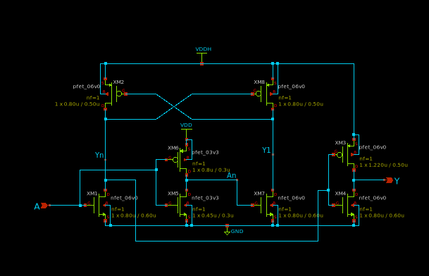
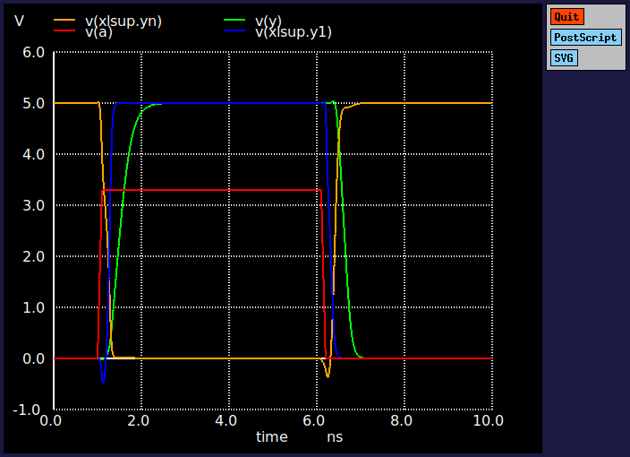

# Level-Shifter Up (3.3V to 5V)

Designer: Saroj Rout

## Description

The **function** of this block is to pass a digital signal from a **low-voltage** (3.3V) domain to a **high-voltage** (5V) domain. This ceel will typically sit on the periphery of the IP do translate signals from one voltage domain to another. 

The **architecture** of the block is a classic _latch-type_ level shifter where, the _low-voltage input_ is provided to a _pseudo-differential_ input pair and the output current of that pair is fed to a _PMOS-latch_. 

Since this is a latch, the **analyis** is done to make sure the latch can be flipped when the input is flipped (`0->1` or `1->0`).

As shown in the _figure_, we will analyze for the condition input (`A`) switching from `0 -> 3.3V`. At the moment when the input is switched, **M1: saturation**, **M3: linear** and we need $V_{GS}(M_4) > |V_{tp}|$. Based on typical values, $(W/L)_1 = 0.742 (W/L)_3$ . With some margin we will design with all **equal transistor sizes**. 

## Design and Simulation

**SCHEMATIC**

**SIMULATION RESULTS**

